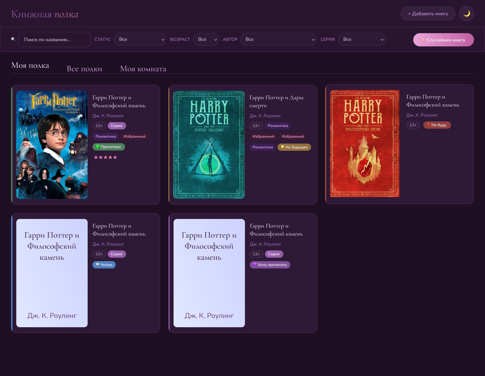
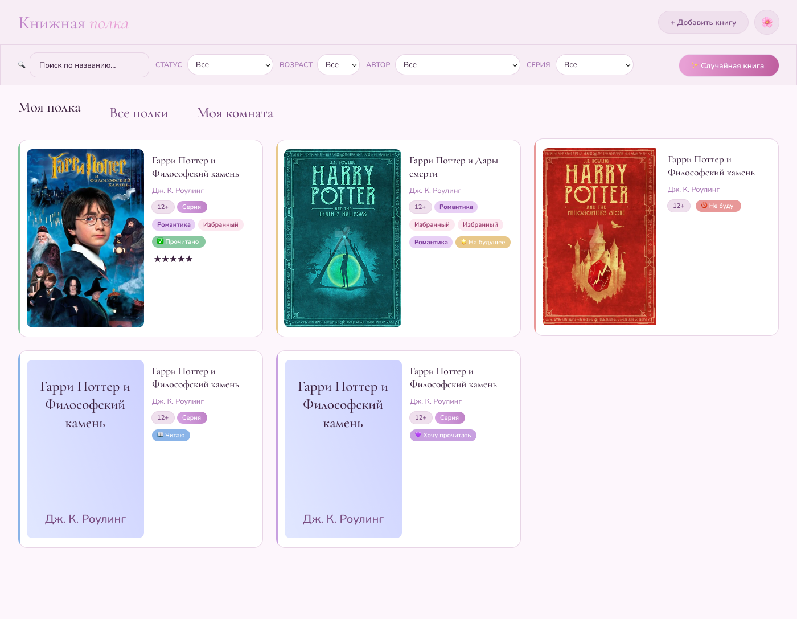

# 📖 My Shelf — Твой уютный книжный уголок

**My Shelf** — это веб-приложение для книголюбов, которое помогает структурировать личную библиотеку, отслеживать прогресс чтения и сохранять любимые тропы.


---

---

## ✨ Особенности

- **Две темы** — нежная светлая и атмосферная тёмная
- **Умная форма** — добавление книг с обложкой, жанрами, тропами и личными заметками
- **Статусы чтения** — «Читаю», «Прочитано», «Хочу», «На потом», «Брошено»
- **Рейтинг и мнение** — ставь оценку и записывай впечатления после прочтения
- **Серии и циклы** — приложение само следит за порядком книг в серии
- **Случайная книга** — не знаешь, что читать? Пусть приложение решит за тебя
- **Умные фильтры** — поиск по названию, автору, жанру, тропу, возрасту и статусу
- **Облако + офлайн** — данные хранятся в Firebase и локально через IndexedDB
- **Авторизация** — через Google или email/пароль, чтобы полка была с тобой везде

---

## 🚀 Как открыть приложение

### 🌐 Прямо в браузере
Приложение опубликовано на GitHub Pages — ничего устанавливать не нужно:

👉 **[ellinaroman.github.io/my-shelf/](https://ellinaroman.github.io/my-shelf/)**

### 📱 Установить как приложение (PWA)
My Shelf — это полноценное Progressive Web App. Можно установить на телефон или компьютер и пользоваться как обычным приложением.

**На Android / Chrome:**
1. Открой сайт в Chrome
2. Нажми `⋮` → «Добавить на главный экран»

**На iOS / Safari:**
1. Открой сайт в Safari
2. Нажми кнопку «Поделиться» → «На экран "Домой"»

**На компьютере / Chrome:**
1. Открой сайт в Chrome
2. В адресной строке нажми на иконку установки `⊕`

### 💾 Запустить локально
```bash
git clone https://github.com/EllinaRoman/my-shelf.git
cd my-shelf
```
Затем просто открой `index.html` в браузере — или используй любой локальный сервер.

---

## 🎨 Стек технологий

| Технология | Для чего |
|---|---|
| **HTML5** | Семантическая разметка |
| **CSS3** | Custom Properties, Flexbox/Grid, анимации |
| **Vanilla JS** | Логика приложения, ES-модули |
| **Firebase Firestore** | Облачное хранилище книг |
| **Firebase Auth** | Авторизация через Google и email |
| **IndexedDB** | Локальное хранилище для офлайн-режима |
| **PWA / Service Worker** | Установка на устройство, кеширование |

---

## 📁 Структура проекта

```
my-shelf/
├── css/              # Стили, разбитые по модулям
├── js/
│   ├── main.js       # Точка входа
│   └── modules/      # Модули: книги, фильтры, модалки, хранилище...
├── img/              # Иконки и превью
├── index.html        # Единственная страница приложения
├── sw.js             # Service Worker
└── manifest.json     # PWA-манифест
```
